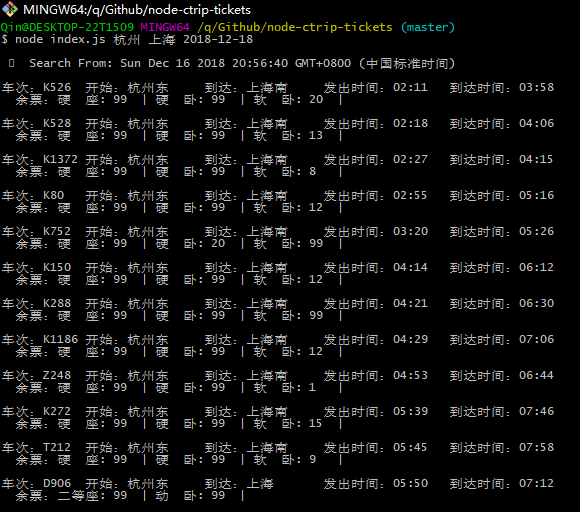
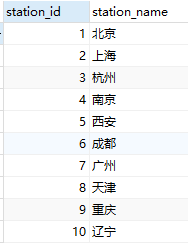
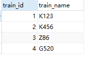
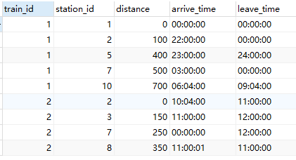
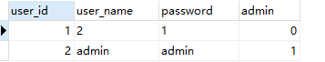

# train_system_java
火车订票系统

# 后台接口

[参考仓库](https://github.com/yanm1ng/node-ctrip-tickets)

# 数据

使用data文件夹里的sql文件导入对应的数据集

### station表

### train表

### train_station表

### user表

--- 

## 关于我

Github:https://github.com/Qinxianshen

CSDN: https://blog.csdn.net/Qin_xian_shen

个人博客: http://saijiadexiaoqin.cn/

Gitchat:https://gitbook.cn/gitchat/author/59ef0b02a276fd1a69094634

哔哩哔哩：https://space.bilibili.com/126021651/#/

微信公众号：松爱家的小秦

更多LIVE：

[如何利用 Selenium 爬取评论数据？](https://gitbook.cn/gitchat/activity/59ef0fbf54011222e227c720)

[Neo4j 图数据库在社交网络等领域的应用](https://gitbook.cn/gitchat/activity/5a310961259a166307ceadb4)

[如何快速编写小程序商城和安卓 APP 商城](https://gitbook.cn/gitchat/activity/5b628776ff984e633d987f7d)
