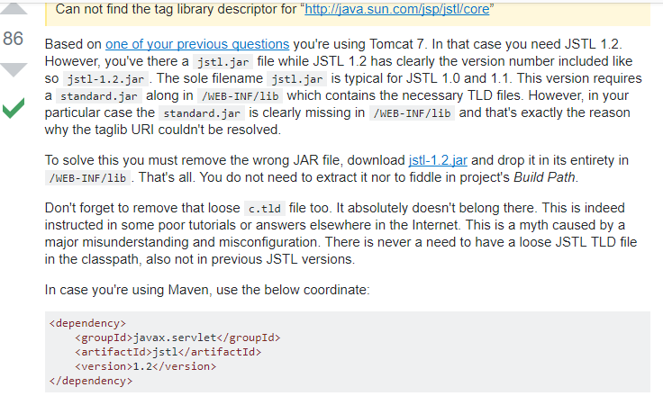
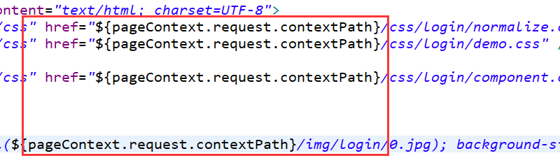

# train_system_java
火车订票系统

# 后台接口

[参考仓库](https://github.com/yanm1ng/node-ctrip-tickets)

# 数据

使用data文件夹里的sql文件导入对应的数据集

### station表

### train表

### train_station表

### user表

# SpringMVC + Maven

### 登陆界面

### 成功

### 失败

### 简单查询

# 问题

## 出现<%@ taglib prefix="c" uri="http://java.sun.com/jsp/jstl/core" %>错误的问题时

参考这个答案：[解决方案](https://stackoverflow.com/questions/13285826/can-not-find-the-tag-library-descriptor-for-http-java-sun-com-jsp-jstl-core)

## 出现${message}参数传不了的情况时候

参考这个博客：[解决方案](https://techforworld.wordpress.com/2016/10/21/spring-mvc-modelview-object-values-not-showing-using-el/)

## SpringMVC使用可以访问静态资源，但是导致Controller访问失败

参考这个博客：[解决方案](https://blog.csdn.net/wu9333/article/details/70859860)

## Controller跳转jsp时无法加载静态资源

需要加上绝对路径${pageContext.request.contextPath}

参考这个教程：[解决方案](https://www.yiibai.com/spring_mvc/configuring-static-resource-and-resource-bundle-in-spring-mvc.html)

--- 

## 关于我

Github:https://github.com/Qinxianshen

CSDN: https://blog.csdn.net/Qin_xian_shen

个人博客: http://saijiadexiaoqin.cn/

Gitchat:https://gitbook.cn/gitchat/author/59ef0b02a276fd1a69094634

哔哩哔哩：https://space.bilibili.com/126021651/#/

微信公众号：松爱家的小秦

更多LIVE：

[如何利用 Selenium 爬取评论数据？](https://gitbook.cn/gitchat/activity/59ef0fbf54011222e227c720)

[Neo4j 图数据库在社交网络等领域的应用](https://gitbook.cn/gitchat/activity/5a310961259a166307ceadb4)

[如何快速编写小程序商城和安卓 APP 商城](https://gitbook.cn/gitchat/activity/5b628776ff984e633d987f7d)
